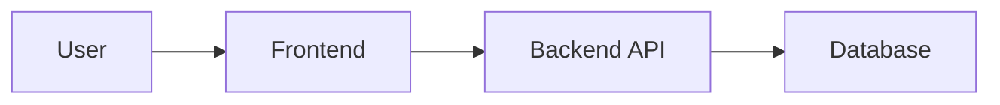

# Documentation Guide - Smart Ingredients

## Overview

This directory contains all project documentation following a documentation-driven development approach. **All features must be documented before implementation.**

## Directory Structure

```
docs/
├── README.md                     # This file - documentation guide
├── requirements/                 # Feature requirements and specifications
│   ├── XXX-feature-requirements.md
│   └── XXX-feature-technical-plan.md
├── design/                       # Technical design documents
│   ├── technical-design.md       # Overall system design
│   └── ui-design.md             # UI/UX design decisions
├── api/                          # API documentation
│   └── api-reference.md         # API endpoint reference
├── standards/                    # Coding standards and conventions
│   ├── coding-standards.md      # Rust coding standards
│   ├── project-conventions.md   # Project-specific conventions
│   ├── requirements-template.md # Template for requirements docs
│   └── technical-design-template.md # Template for design docs
├── analysis/                     # Project analysis and research
│   └── project-analysis.md      # Codebase analysis
└── run/                          # Operational guides
    ├── backend-startup.md       # Backend setup guide
    └── integration-testing.md   # Testing guide
```

## Documentation Workflow

### 1. Requirements Phase

**When**: Before starting any new feature

**Create**: `docs/requirements/NNN-feature-name-requirements.md`

**Template**: Use `docs/standards/requirements-template.md`

**Contents**:
- Feature overview and motivation
- User stories or use cases
- Success criteria
- Non-goals (what we're NOT doing)
- Dependencies and constraints

**Example**:
```bash
# For feature "User Authentication"
docs/requirements/005-authentication-requirements.md
docs/requirements/005-authentication-technical-plan.md
```

### 2. Design Phase

**When**: After requirements are clear, before implementation

**Create**: `docs/design/feature-name-design.md` or update `technical-design.md`

**Template**: Use `docs/standards/technical-design-template.md`

**Contents**:
- Architecture decisions
- Data structures and models
- API contracts (request/response formats)
- Error handling strategy
- Security considerations
- Performance considerations

### 3. Implementation Phase

**When**: After design is documented and approved

**Do**:
- Implement code following documented design
- Reference design doc sections in code comments
- Use patterns from `docs/standards/`

### 4. Update Phase

**When**: If implementation deviates from design

**Do**:
- Update design docs to reflect actual implementation
- Document reasons for deviations
- Update API docs if contracts changed

## Document Naming Conventions

### Requirements Documents

Format: `NNN-feature-name-requirements.md`

Examples:
- `001-mobile-ui-requirements.md`
- `002-mvp-backend-requirements.md`
- `003-ocr-quality-requirements.md`

### Technical Plans

Format: `NNN-feature-name-technical-plan.md`

Examples:
- `001-mobile-ui-technical-plan.md`
- `002-mvp-backend-technical-plan.md`

### Design Documents

Format: `feature-name-design.md` or `component-name-design.md`

Examples:
- `authentication-design.md`
- `caching-strategy-design.md`
- `ui-design.md`

## How to Use This Documentation

### For New Features

1. **Read existing docs first**
   ```bash
   # Check if feature already documented
   grep -r "feature name" docs/requirements/
   grep -r "feature name" docs/design/
   ```

2. **Create requirements doc**
   ```bash
   cp docs/standards/requirements-template.md \
      docs/requirements/NNN-feature-requirements.md
   # Fill in the template
   ```

3. **Create technical plan**
   ```bash
   cp docs/standards/technical-design-template.md \
      docs/requirements/NNN-feature-technical-plan.md
   # Fill in the template
   ```

4. **Update design docs**
   - Add to `docs/design/technical-design.md` if architectural
   - Create separate design doc if complex feature

5. **Update API docs**
   - Add new endpoints to `docs/api/api-reference.md`
   - Document request/response formats
   - Include error responses

### For Bug Fixes

1. **Document the bug**
   - What is the expected behavior?
   - What is the actual behavior?
   - Root cause analysis

2. **Document the fix**
   - What changes are needed?
   - Why this approach?
   - Any side effects?

3. **Update relevant docs**
   - Fix incorrect information
   - Add lessons learned

### For Refactoring

1. **Document motivation**
   - Why refactor?
   - What problems does it solve?

2. **Document approach**
   - What will change?
   - Migration strategy
   - Backwards compatibility

3. **Update affected docs**
   - Design docs
   - API docs (if contracts change)
   - Coding standards (if patterns change)

## Document Templates

### Requirements Template

Located at: `docs/standards/requirements-template.md`

Use for: All new feature requirements

### Technical Design Template

Located at: `docs/standards/technical-design-template.md`

Use for: All technical design documents

## Documentation Standards

### Writing Style

- **Clear and concise**: Avoid jargon, use simple language
- **Structured**: Use headings, lists, tables
- **Examples**: Include code examples where helpful
- **Up-to-date**: Keep docs in sync with code

### Code Examples

- Use syntax highlighting (```rust)
- Keep examples minimal and focused
- Include comments explaining key points
- Ensure examples actually work

### Diagrams

- Use Mermaid for diagrams (supported in GitHub)
- Keep diagrams simple and focused
- Include text description for accessibility

Example:


### Links

- Use relative links within docs: `[Design](./design/technical-design.md)`
- Use absolute links for external resources
- Check links periodically

## Review Process

### Documentation Review

Before implementation:
1. Requirements reviewed by team
2. Design reviewed by tech lead
3. API contracts reviewed by frontend/backend

During implementation:
1. Code references design docs
2. Deviations documented immediately

After implementation:
1. Docs updated to match reality
2. Lessons learned added
3. Examples validated

### Documentation Checklist

- [ ] Requirements clearly stated
- [ ] Success criteria defined
- [ ] Design decisions documented
- [ ] API contracts specified
- [ ] Error handling documented
- [ ] Security considerations addressed
- [ ] Performance considerations addressed
- [ ] Examples provided
- [ ] Links work
- [ ] No typos or grammar issues

## Maintenance

### Regular Tasks

**Weekly**:
- Review new documentation
- Check for outdated information

**Monthly**:
- Validate code examples still work
- Update links
- Archive obsolete documents

**Per Release**:
- Update version numbers
- Update deployment docs
- Archive old API versions

### Archiving Old Docs

When documentation becomes obsolete:

1. Move to `docs/archive/` directory
2. Add "ARCHIVED" prefix to filename
3. Add archive notice at top of document:
   ```markdown
   > **ARCHIVED**: This document is outdated as of YYYY-MM-DD.
   > See [new-doc.md](../path/to/new-doc.md) for current information.
   ```

## FAQ

### Q: Do I need to document small changes?

**A**: For trivial changes (typo fixes, formatting), no. For anything that changes behavior or adds features, yes.

### Q: What if requirements change during implementation?

**A**: Update the requirements doc immediately. Document why requirements changed. Update design docs if needed.

### Q: How detailed should design docs be?

**A**: Detailed enough that someone else could implement the feature without asking questions. Include:
- Data structures
- API contracts
- Error handling
- Edge cases

### Q: Can I start coding before docs are complete?

**A**: No. This is a hard rule. Documentation first, always. It saves time in the long run.

### Q: What if I discover a better approach during implementation?

**A**: Stop, update the design doc, get approval if needed, then continue. Document why the new approach is better.

### Q: How do I handle experimental features?

**A**: Create a design doc in `docs/design/experiments/`. Mark it as experimental. If successful, move to main design docs.

## Resources

### Internal Resources

- [Coding Standards](./standards/coding-standards.md)
- [Project Conventions](./standards/project-conventions.md)
- [API Reference](./api/api-reference.md)
- [Technical Design](./design/technical-design.md)

### External Resources

- [Rust API Guidelines](https://rust-lang.github.io/api-guidelines/)
- [Axum Documentation](https://docs.rs/axum/)
- [Leptos Documentation](https://leptos.dev/)
- [SQLx Documentation](https://docs.rs/sqlx/)

## Contact

For questions about documentation:
- Check this guide first
- Review existing docs for examples
- Ask in team chat
- Open a discussion issue

---

**Remember**: Good documentation is an investment. It saves time, prevents bugs, and makes collaboration easier.
