# 013-底部导航与首次引导技术方案

## 元数据

| 字段     | 值                                       |
| -------- | ---------------------------------------- |
| 文档编号 | 013-tab-navigation-technical-plan        |
| 标题     | 底部 Tab 导航与首次引导技术方案          |
| 版本     | 1.0                                      |
| 状态     | 草稿                                     |
| 创建日期 | 2026-01-26                               |
| 更新日期 | 2026-01-26                               |
| 作者     | Claude Code                              |
| 关联需求 | 013-tab-navigation-and-onboarding        |

## 概述

### 目的

本文档描述底部 Tab 导航和首次引导功能的技术实现方案，包括组件设计、路由配置、状态管理和数据持久化策略。

### 范围

本设计涵盖：
- 底部导航组件（BottomNav）
- 首次引导页组件（OnboardingPage）
- 简化版首页组件（CapturePage 重构）
- 登录页优化（LoginPage 增强）
- LocalStorage 数据管理
- 路由配置与状态保持

### 假设

- 使用 Leptos 0.7.x 框架
- 使用 Leptos Router 进行路由管理
- 使用 LocalStorage 存储客户端状态
- 现有 AppState 结构可扩展
- CSS 样式遵循现有设计系统

## 架构设计

### 高层架构

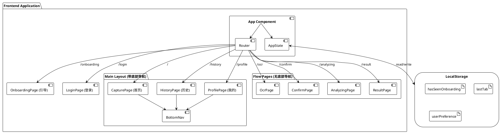

### 组件关系图

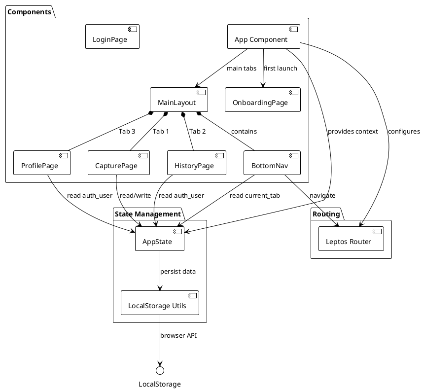

### 数据流图

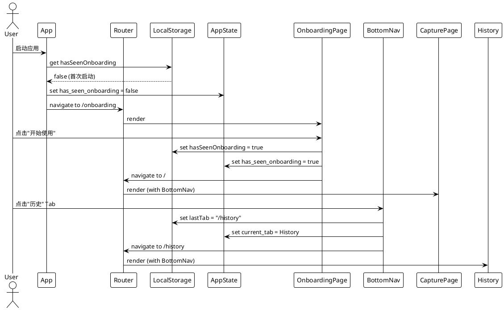

### 技术栈

| 组件          | 技术                  | 选择理由                             |
| ------------- | --------------------- | ------------------------------------ |
| UI 框架       | Leptos 0.7.x          | 现有技术栈，响应式组件               |
| 路由          | Leptos Router         | 官方路由库，支持嵌套路由             |
| 状态管理      | Leptos Signals        | 细粒度响应式状态                     |
| 本地存储      | web-sys LocalStorage  | 浏览器原生 API，持久化客户端状态     |
| 样式          | CSS + Figma Design    | 现有设计系统                         |
| 图标          | 自定义 SVG Components | 轻量级，易于定制                     |

## 数据模型

### AppState 扩展

```rust
#[derive(Clone, Copy)]
pub struct AppState {
    // 现有字段（保持不变）
    pub analysis_id: RwSignal<Option<Uuid>>,
    pub analysis_result: RwSignal<Option<AnalysisResponse>>,
    pub analysis_preference: RwSignal<Option<String>>,
    pub error_message: RwSignal<Option<String>>,
    pub ocr_text: RwSignal<Option<String>>,
    pub confirmed_text: RwSignal<Option<String>>,
    pub loading_state: RwSignal<LoadingState>,
    pub result_page_state: RwSignal<ResultPageState>,
    pub error: RwSignal<Option<ErrorInfo>>,
    pub selected_image_path: RwSignal<Option<String>>,
    pub toasts: RwSignal<Vec<ToastMessage>>,
    pub auth_user: RwSignal<Option<UserProfile>>,
    pub auth_loading: RwSignal<bool>,

    // 新增字段
    pub current_tab: RwSignal<TabRoute>,           // 当前激活的 Tab
    pub has_seen_onboarding: RwSignal<bool>,       // 是否已看过引导页
}
```

### TabRoute 枚举

```rust
#[derive(Debug, Clone, Copy, PartialEq, Eq)]
pub enum TabRoute {
    Home,      // 首页
    History,   // 历史
    Profile,   // 我的
}

impl TabRoute {
    pub fn path(&self) -> &'static str {
        match self {
            TabRoute::Home => "/",
            TabRoute::History => "/history",
            TabRoute::Profile => "/profile",
        }
    }

    pub fn label(&self) -> &'static str {
        match self {
            TabRoute::Home => "首页",
            TabRoute::History => "历史",
            TabRoute::Profile => "我的",
        }
    }

    pub fn icon(&self) -> &'static str {
        match self {
            TabRoute::Home => "🏠",
            TabRoute::History => "📋",
            TabRoute::Profile => "👤",
        }
    }
}
```

### LocalStorage 数据结构

```rust
// LocalStorage Keys
pub const KEY_HAS_SEEN_ONBOARDING: &str = "hasSeenOnboarding";
pub const KEY_LAST_TAB: &str = "lastTab";
pub const KEY_PREFERENCE: &str = "userPreference";

// LocalStorage 工具函数
pub mod local_storage {
    use web_sys::window;

    pub fn get_has_seen_onboarding() -> bool {
        window()
            .and_then(|w| w.local_storage().ok().flatten())
            .and_then(|storage| storage.get_item(KEY_HAS_SEEN_ONBOARDING).ok().flatten())
            .map(|v| v == "true")
            .unwrap_or(false)
    }

    pub fn set_has_seen_onboarding(value: bool) {
        if let Some(storage) = window()
            .and_then(|w| w.local_storage().ok().flatten())
        {
            let _ = storage.set_item(KEY_HAS_SEEN_ONBOARDING, if value { "true" } else { "false" });
        }
    }

    pub fn get_last_tab() -> Option<String> {
        window()
            .and_then(|w| w.local_storage().ok().flatten())
            .and_then(|storage| storage.get_item(KEY_LAST_TAB).ok().flatten())
    }

    pub fn set_last_tab(tab: &str) {
        if let Some(storage) = window()
            .and_then(|w| w.local_storage().ok().flatten())
        {
            let _ = storage.set_item(KEY_LAST_TAB, tab);
        }
    }
}
```

## 组件设计

### 1. OnboardingPage 组件

**文件路径**: `frontend/src/pages/onboarding.rs`

**功能**:
- 显示产品介绍和使用步骤
- 提供"开始使用"和"跳过"按钮
- 点击后设置 LocalStorage 标记并跳转首页

**流程图**:

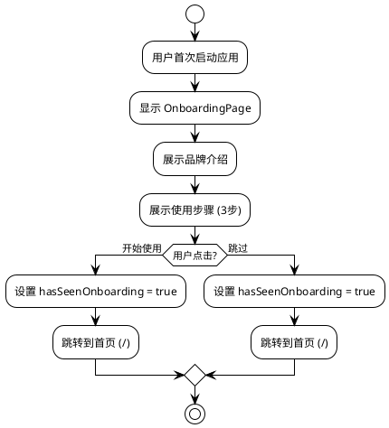

**组件签名**:
```rust
#[component]
pub fn OnboardingPage() -> impl IntoView {
    let state = use_context::<AppState>().expect("AppState not found");
    let navigate = use_navigate();

    let on_start = move |_| {
        local_storage::set_has_seen_onboarding(true);
        state.has_seen_onboarding.set(true);
        navigate("/", Default::default());
    };

    let on_skip = move |_| {
        local_storage::set_has_seen_onboarding(true);
        state.has_seen_onboarding.set(true);
        navigate("/", Default::default());
    };

    view! {
        <section class="page page-onboarding">
            <div class="onboarding-hero">
                <div class="brand-mark">
                    <div class="brand-icon">"SI"</div>
                    <div class="brand-ai">"AI"</div>
                </div>
                <h1 class="onboarding-title">"Smart Ingredients"</h1>
                <p class="onboarding-subtitle">"AI智能配料表分析"</p>
                <p class="onboarding-description">
                    "拍摄识别配料表，AI分析健康风险，让您吃得更安心"
                </p>
            </div>

            <div class="onboarding-steps">
                <h2>"使用步骤"</h2>
                <div class="step-list">
                    <div class="step-item">
                        <div class="step-number">"1"</div>
                        <div class="step-icon">"🎥"</div>
                        <h3>"拍摄配料表"</h3>
                        <p>"对准食品包装上的配料表拍照"</p>
                    </div>
                    <div class="step-item">
                        <div class="step-number">"2"</div>
                        <div class="step-icon">"✅"</div>
                        <h3>"确认识别文本"</h3>
                        <p>"AI自动识别配料信息"</p>
                    </div>
                    <div class="step-item">
                        <div class="step-number">"3"</div>
                        <div class="step-icon">"📊"</div>
                        <h3>"查看健康报告"</h3>
                        <p>"获取详细的成分分析和建议"</p>
                    </div>
                </div>
            </div>

            <div class="onboarding-actions">
                <button class="primary-cta" on:click=on_start>
                    "开始使用"
                </button>
                <button class="link-button" on:click=on_skip>
                    "跳过"
                </button>
            </div>
        </section>
    }
}
```

### 2. BottomNav 组件

**文件路径**: `frontend/src/components/bottom_nav.rs`

**功能**:
- 显示 3 个 Tab（首页、历史、我的）
- 高亮当前激活的 Tab
- 点击 Tab 切换路由

**状态图**:

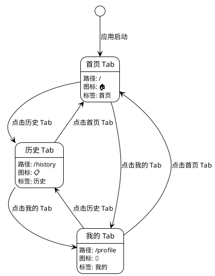

**组件签名**:
```rust
#[component]
pub fn BottomNav() -> impl IntoView {
    let state = use_context::<AppState>().expect("AppState not found");
    let navigate = use_navigate();
    let location = use_location();

    // 根据当前路径判断激活的 Tab
    let current_tab = create_memo(move |_| {
        let path = location.pathname.get();
        match path.as_str() {
            "/" => TabRoute::Home,
            "/history" => TabRoute::History,
            "/profile" => TabRoute::Profile,
            _ => TabRoute::Home,
        }
    });

    let on_tab_click = move |tab: TabRoute| {
        local_storage::set_last_tab(tab.path());
        state.current_tab.set(tab);
        navigate(tab.path(), Default::default());
    };

    view! {
        <nav class="bottom-nav">
            <For
                each=move || [TabRoute::Home, TabRoute::History, TabRoute::Profile]
                key=|tab| format!("{:?}", tab)
                children=move |tab| {
                    let is_active = move || current_tab.get() == tab;
                    view! {
                        <button
                            class:tab-item=true
                            class:active=is_active
                            on:click=move |_| on_tab_click(tab)
                            aria-label=tab.label()
                            aria-current=move || if is_active() { "page" } else { "" }
                        >
                            <span class="tab-icon">{tab.icon()}</span>
                            <span class="tab-label">{tab.label()}</span>
                        </button>
                    }
                }
            />
        </nav>
    }
}
```

### 3. MainLayout 组件

**文件路径**: `frontend/src/components/main_layout.rs`

**功能**:
- 包裹主要 Tab 页面
- 显示底部导航
- 管理页面内容区域

**组件签名**:
```rust
#[component]
pub fn MainLayout(children: Children) -> impl IntoView {
    view! {
        <div class="main-layout">
            <div class="main-content">
                {children()}
            </div>
            <BottomNav />
        </div>
    }
}
```

### 4. 简化版 CapturePage

**文件路径**: `frontend/src/pages/capture.rs` (重构)

**主要变更**:
- 移除 Brand Mark（移到 OnboardingPage）
- 移除使用步骤（移到 OnboardingPage）
- 移除"查看示例"（可选）
- 添加"最近分析"区域（登录后显示）
- 添加登录提示（未登录时显示）

**关键代码片段**:
```rust
#[component]
pub fn CapturePage() -> impl IntoView {
    let state = use_context::<AppState>().expect("AppState not found");
    let navigate = use_navigate();

    // ... 现有逻辑保持不变 ...

    view! {
        <section class="page page-capture-simple">
            {/* 移除 Brand Mark 和使用步骤 */}

            {/* 拍照按钮区域 */}
            <div class="capture-hero">
                <button class="primary-cta large" on:click=on_select_camera>
                    <span class="cta-icon">"📷"</span>
                    <span class="cta-text">"开始分析配料表"</span>
                </button>
            </div>

            {/* 未登录提示 */}
            <Show when=move || state.auth_user.get().is_none()>
                <div class="login-hint" on:click=move |_| navigate("/login", Default::default())>
                    <span class="hint-icon">"💡"</span>
                    <span class="hint-text">"登录保存历史记录"</span>
                </div>
            </Show>

            {/* 最近分析（登录后显示） */}
            <Show when=move || state.auth_user.get().is_some()>
                <div class="recent-analyses">
                    <h2>"最近分析"</h2>
                    {/* 显示最近 3 条记录 */}
                </div>
            </Show>
        </section>
    }
}
```

### 5. 优化后的 LoginPage

**文件路径**: `frontend/src/pages/login.rs` (增强)

**主要变更**:
- 添加功能介绍列表
- 添加"跳过，稍后登录"链接

**关键代码片段**:
```rust
#[component]
pub fn LoginPage() -> impl IntoView {
    // ... 现有逻辑保持不变 ...

    view! {
        <section class="page page-login figma">
            <div class="login-hero">
                <div class="brand-mark">
                    <div class="brand-icon">"SI"</div>
                    <div class="brand-ai">"AI"</div>
                </div>
                <h2 class="login-title">"Smart Ingredients"</h2>
                <p class="login-subtitle">"登录以同步您的数据"</p>

                {/* 新增：功能介绍 */}
                <div class="login-benefits">
                    <div class="benefit-item">
                        <span class="benefit-icon">"✓"</span>
                        <span class="benefit-text">"保存分析历史，随时查看"</span>
                    </div>
                    <div class="benefit-item">
                        <span class="benefit-icon">"✓"</span>
                        <span class="benefit-text">"跨设备同步偏好设置"</span>
                    </div>
                    <div class="benefit-item">
                        <span class="benefit-icon">"✓"</span>
                        <span class="benefit-text">"查看分析次数统计"</span>
                    </div>
                </div>
            </div>

            {/* 现有登录表单 */}
            <div class="login-form">
                {/* ... */}
            </div>

            {/* 新增：跳过链接 */}
            <div class="login-footer">
                <button
                    class="link-button"
                    on:click=move |_| navigate("/", Default::default())
                >
                    "跳过，稍后登录"
                </button>
            </div>
        </section>
    }
}
```

## 路由配置

### 路由结构图

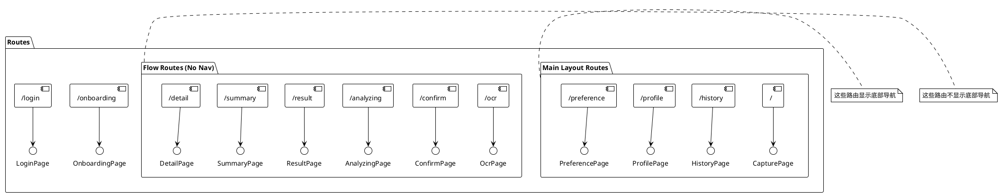

### 路由配置代码

```rust
// frontend/src/lib.rs

#[component]
pub fn App() -> impl IntoView {
    let state = /* ... 初始化 AppState ... */;

    // 检查是否已看过引导页
    let has_seen_onboarding = local_storage::get_has_seen_onboarding();
    state.has_seen_onboarding.set(has_seen_onboarding);

    provide_context(state);

    view! {
        <Router>
            <main class="app-shell">
                <ToastHost />
                <Routes fallback=|| view! { <p>"Not found"</p> }>
                    {/* 引导页路由 */}
                    <Route path=path!("/onboarding") view=OnboardingPage />

                    {/* 登录页路由 */}
                    <Route path=path!("/login") view=LoginPage />

                    {/* 主 Tab 路由（带底部导航） */}
                    <Route path=path!("/") view=move || view! {
                        <MainLayout>
                            <CapturePage />
                        </MainLayout>
                    } />
                    <Route path=path!("/history") view=move || view! {
                        <MainLayout>
                            <HistoryPage />
                        </MainLayout>
                    } />
                    <Route path=path!("/profile") view=move || view! {
                        <MainLayout>
                            <ProfilePage />
                        </MainLayout>
                    } />
                    <Route path=path!("/preference") view=move || view! {
                        <MainLayout>
                            <PreferencePage />
                        </MainLayout>
                    } />

                    {/* 分析流程路由（无底部导航） */}
                    <Route path=path!("/ocr") view=OcrPage />
                    <Route path=path!("/confirm") view=ConfirmPage />
                    <Route path=path!("/analyzing") view=AnalyzingPage />
                    <Route path=path!("/result") view=ResultPage />
                    <Route path=path!("/summary") view=SummaryPage />
                    <Route path=path!("/detail") view=DetailPage />
                </Routes>
            </main>
        </Router>
    }
}
```

### 首次启动逻辑流程图

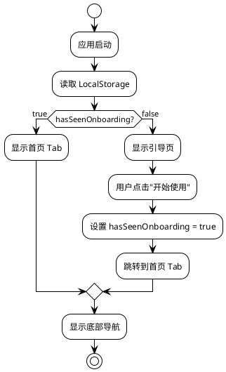

### 首次启动检测代码

```rust
// 在 App 组件中添加首次启动检测
create_effect(move |_| {
    let has_seen = state.has_seen_onboarding.get();
    if !has_seen {
        // 首次启动，跳转到引导页
        navigate("/onboarding", Default::default());
    }
});
```

## 样式设计

### 底部导航样式

```css
/* frontend/src/styles/bottom-nav.css */

.bottom-nav {
    position: fixed;
    bottom: 0;
    left: 0;
    right: 0;
    height: 56px;
    background: var(--surface-primary);
    border-top: 1px solid var(--border-subtle);
    display: flex;
    justify-content: space-around;
    align-items: center;
    padding: 0 env(safe-area-inset-right) env(safe-area-inset-bottom) env(safe-area-inset-left);
    z-index: 100;
}

.tab-item {
    display: flex;
    flex-direction: column;
    align-items: center;
    justify-content: center;
    gap: 4px;
    padding: 8px 16px;
    min-width: 64px;
    min-height: 44px; /* 最小触摸区域 */
    background: transparent;
    border: none;
    cursor: pointer;
    transition: all 0.2s ease;
}

.tab-item:hover {
    background: var(--surface-hover);
}

.tab-item.active {
    color: var(--primary);
}

.tab-item.active .tab-icon {
    transform: scale(1.1);
}

.tab-icon {
    font-size: 24px;
    transition: transform 0.2s ease;
}

.tab-label {
    font-size: 12px;
    font-weight: 500;
}

/* 主布局样式 */
.main-layout {
    display: flex;
    flex-direction: column;
    min-height: 100vh;
}

.main-content {
    flex: 1;
    padding-bottom: 56px; /* 底部导航高度 */
    overflow-y: auto;
}
```

### 引导页样式

```css
/* frontend/src/styles/onboarding.css */

.page-onboarding {
    display: flex;
    flex-direction: column;
    justify-content: space-between;
    min-height: 100vh;
    padding: 32px 20px;
    background: linear-gradient(135deg, var(--primary-light) 0%, var(--surface-primary) 100%);
}

.onboarding-hero {
    text-align: center;
}

.onboarding-title {
    font-size: 28px;
    font-weight: 700;
    margin: 16px 0 8px;
}

.onboarding-subtitle {
    font-size: 18px;
    color: var(--text-secondary);
    margin-bottom: 8px;
}

.onboarding-description {
    font-size: 14px;
    color: var(--text-tertiary);
    line-height: 1.6;
}

.onboarding-steps {
    flex: 1;
    display: flex;
    flex-direction: column;
    justify-content: center;
}

.step-list {
    display: flex;
    flex-direction: column;
    gap: 24px;
}

.step-item {
    display: flex;
    align-items: flex-start;
    gap: 16px;
    padding: 16px;
    background: var(--surface-primary);
    border-radius: 12px;
    box-shadow: 0 2px 8px rgba(0, 0, 0, 0.08);
}

.step-number {
    display: flex;
    align-items: center;
    justify-content: center;
    width: 32px;
    height: 32px;
    background: var(--primary);
    color: white;
    border-radius: 50%;
    font-weight: 700;
}

.step-icon {
    font-size: 32px;
}

.onboarding-actions {
    display: flex;
    flex-direction: column;
    gap: 12px;
}
```

### 简化版首页样式

```css
/* frontend/src/styles/capture-simple.css */

.page-capture-simple {
    display: flex;
    flex-direction: column;
    gap: 24px;
    padding: 32px 20px;
    min-height: calc(100vh - 56px); /* 减去底部导航高度 */
}

.capture-hero {
    display: flex;
    justify-content: center;
    align-items: center;
    min-height: 200px;
}

.primary-cta.large {
    display: flex;
    flex-direction: column;
    align-items: center;
    gap: 12px;
    padding: 32px 48px;
    font-size: 18px;
}

.cta-icon {
    font-size: 48px;
}

.login-hint {
    display: flex;
    align-items: center;
    justify-content: center;
    gap: 8px;
    padding: 12px 20px;
    background: var(--surface-info);
    border-radius: 8px;
    cursor: pointer;
    transition: all 0.2s ease;
}

.login-hint:hover {
    background: var(--surface-info-hover);
}

.recent-analyses {
    display: flex;
    flex-direction: column;
    gap: 12px;
}
```

## 错误处理

### LocalStorage 错误处理流程

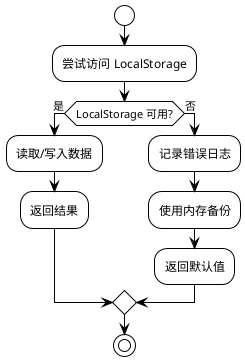

### LocalStorage 错误处理代码

```rust
pub fn safe_get_item(key: &str) -> Option<String> {
    window()
        .and_then(|w| w.local_storage().ok().flatten())
        .and_then(|storage| storage.get_item(key).ok().flatten())
}

pub fn safe_set_item(key: &str, value: &str) -> Result<(), String> {
    window()
        .and_then(|w| w.local_storage().ok().flatten())
        .ok_or_else(|| "LocalStorage not available".to_string())?
        .set_item(key, value)
        .map_err(|_| "Failed to set item".to_string())
}
```

### 路由错误处理

- 如果用户手动输入不存在的路由，显示 404 页面
- 如果路由权限不足（未登录访问需登录页面），重定向到登录页

## 性能考虑

### 优化策略

1. **懒加载**
   - 引导页只在首次启动时加载
   - Tab 页面按需加载（Leptos 自动优化）

2. **状态缓存**
   - Tab 切换时保持页面状态（使用 Leptos Signals）
   - LocalStorage 缓存用户偏好

3. **CSS 优化**
   - 使用 CSS 变量减少重复代码
   - 底部导航使用 `position: fixed` 避免重绘

4. **减少重渲染**
   - 使用 `create_memo` 缓存计算结果
   - 使用 `Show` 组件条件渲染

### 性能指标

- Tab 切换响应时间 < 100ms
- 首页加载时间 < 500ms
- 引导页加载时间 < 300ms
- LocalStorage 读写时间 < 10ms

## 测试策略

### 单元测试

```rust
#[cfg(test)]
mod tests {
    use super::*;

    #[test]
    fn test_tab_route_path() {
        assert_eq!(TabRoute::Home.path(), "/");
        assert_eq!(TabRoute::History.path(), "/history");
        assert_eq!(TabRoute::Profile.path(), "/profile");
    }

    #[test]
    fn test_tab_route_label() {
        assert_eq!(TabRoute::Home.label(), "首页");
        assert_eq!(TabRoute::History.label(), "历史");
        assert_eq!(TabRoute::Profile.label(), "我的");
    }
}
```

### 集成测试流程

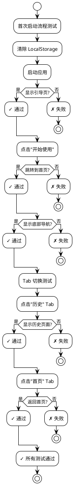

### 测试用例

- **首次启动流程**：未设置标记 → 显示引导页 → 点击开始 → 跳转首页
- **Tab 切换**：点击历史 Tab → 显示历史页面 → 点击首页 Tab → 返回首页
- **登录流程**：未登录访问历史 → 显示引导 → 点击登录 → 登录成功 → 显示历史
- **状态保持**：历史页面滚动到第 3 页 → 切换到首页 → 切换回历史 → 保持第 3 页

### E2E 测试

- **新用户完整流程**：首次启动 → 引导页 → 拍照分析 → 查看结果 → 登录 → 查看历史
- **老用户快速流程**：启动 → 直接首页 → 拍照分析
- **Tab 导航流程**：首页 → 历史 → 我的 → 返回首页

## 实施阶段

### 实施计划甘特图

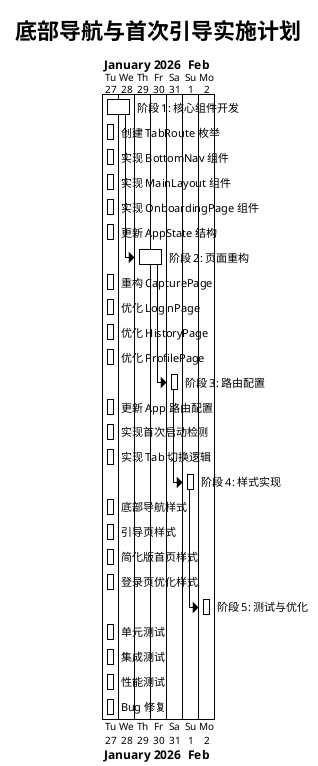

### 阶段 1：核心组件开发（2 天）

- [ ] 创建 `TabRoute` 枚举和 LocalStorage 工具函数
- [ ] 实现 `BottomNav` 组件
- [ ] 实现 `MainLayout` 组件
- [ ] 实现 `OnboardingPage` 组件
- [ ] 更新 `AppState` 结构

### 阶段 2：页面重构（2 天）

- [ ] 重构 `CapturePage`（简化版）
- [ ] 优化 `LoginPage`（添加功能介绍）
- [ ] 优化 `HistoryPage`（未登录引导）
- [ ] 优化 `ProfilePage`（未登录引导）

### 阶段 3：路由配置（1 天）

- [ ] 更新 `App` 组件路由配置
- [ ] 实现首次启动检测逻辑
- [ ] 实现 Tab 切换逻辑
- [ ] 实现状态保持逻辑

### 阶段 4：样式实现（1 天）

- [ ] 实现底部导航样式
- [ ] 实现引导页样式
- [ ] 实现简化版首页样式
- [ ] 实现登录页优化样式
- [ ] 适配移动端（Safe Area）

### 阶段 5：测试与优化（1 天）

- [ ] 编写单元测试
- [ ] 编写集成测试
- [ ] 性能测试与优化
- [ ] 修复 Bug
- [ ] 代码审查

## 风险与缓解

### 风险矩阵

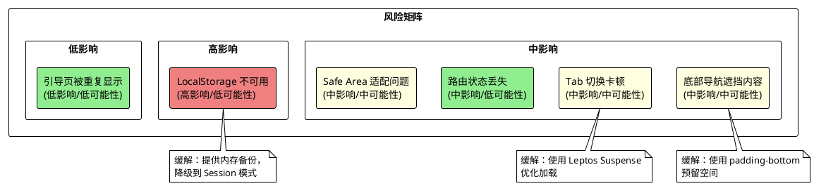

| 风险                           | 影响 | 可能性 | 缓解措施                               |
| ------------------------------ | ---- | ------ | -------------------------------------- |
| LocalStorage 不可用            | 高   | 低     | 提供内存备份，降级到 Session 模式      |
| Tab 切换卡顿                   | 中   | 中     | 使用 Leptos Suspense 优化加载          |
| 引导页被重复显示               | 低   | 低     | 严格检查 LocalStorage 标记             |
| 底部导航遮挡内容               | 中   | 中     | 使用 `padding-bottom` 预留空间         |
| 路由状态丢失                   | 中   | 低     | 使用 Leptos Router 的状态保持功能      |
| 移动端 Safe Area 适配问题      | 中   | 中     | 使用 CSS `env()` 函数适配刘海屏        |

## 待解决问题

| 问题                              | 影响 | 负责人 | 状态 |
| --------------------------------- | ---- | ------ | ---- |
| Tab 图标使用 SVG 还是 Emoji       | 低   | 开发   | 开放 |
| 是否需要 Tab 切换动画             | 低   | 产品   | 开放 |
| 引导页是否支持滑动查看多页        | 中   | 产品   | 开放 |
| 是否需要在设置中提供"重置引导"    | 低   | 产品   | 开放 |
| 底部导航在横屏时如何显示          | 低   | 设计   | 开放 |

## 参考资料

- [Leptos Book - Router](https://leptos-rs.github.io/leptos/router/index.html)
- [Leptos Book - Context](https://leptos-rs.github.io/leptos/view/05_forms.html)
- [MDN - LocalStorage](https://developer.mozilla.org/en-US/docs/Web/API/Window/localStorage)
- [Material Design - Bottom Navigation](https://m3.material.io/components/navigation-bar/overview)
- [iOS HIG - Tab Bars](https://developer.apple.com/design/human-interface-guidelines/tab-bars)
- [PlantUML Documentation](https://plantuml.com/)
- 现有文档：
  - `docs/requirements/013-tab-navigation-and-onboarding-requirements.md`
  - `docs/design/technical-design.md`
  - `docs/standards/coding-standards.md`

---

## 变更记录

| 版本 | 日期       | 作者        | 描述     |
| ---- | ---------- | ----------- | -------- |
| 1.0  | 2026-01-26 | Claude Code | 初始版本 |
